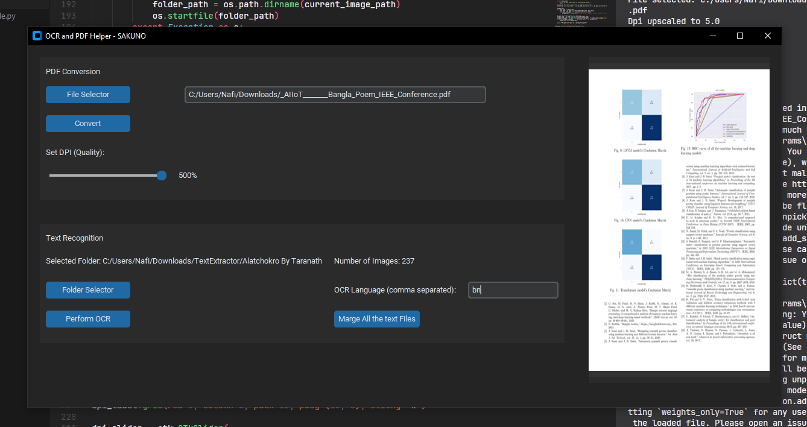

<h1>OCR and PDF Helper - SAKUNO</h1>
This is a graphical tool for performing Optical Character Recognition (OCR) on images and converting PDF files to images. Additionally, it allows for merging text files within a selected folder. The tool is built using <code>CustomTkinter</code> for the GUI, <code>EasyOCR</code> for OCR, <code>pypdfium2</code> for PDF manipulation, and <code>Pillow</code> for image handling.
<h2>Table of Contents</h2><ul><li><a rel="noopener" href="#features">Features</a></li><li><a rel="noopener" href="#installation">Installation</a></li><li><a rel="noopener" href="#usage">Usage</a><ul><li><a rel="noopener" href="#pdf-conversion">PDF Conversion</a></li><li><a rel="noopener" href="#ocr-on-images">OCR on Images</a></li><li><a rel="noopener" href="#merging-text-files">Merging Text Files</a></li></ul></li><li><a rel="noopener" href="#contributing">Contributing</a></li><li><a rel="noopener" href="#license">License</a></li><li><a rel="noopener" href="#author">Author</a></li></ul><h2>Features</h2><ul><li><strong>PDF to Image Conversion</strong>: Convert PDF files into images, with adjustable DPI settings for image quality.</li><li><strong>OCR on Images</strong>: Perform OCR on images in a selected folder to extract text and save it as <code>.txt</code> files.</li><li><strong>Merge Text Files</strong>: Merge all text files in a folder into a single text file.</li><li><strong>User-friendly GUI</strong>: Built with <code>CustomTkinter</code>, making it easy to navigate.</li></ul><h2>Installation</h2>
To run this project, you need to have Python installed. Follow these steps to set it up:
<ol><li>
Clone the repository:
<pre class="!overflow-visible">

bash

<button class="flex gap-1 items-center py-1"><svg width="24" height="24" viewBox="0 0 24 24" fill="none" xmlns="http://www.w3.org/2000/svg" class="icon-sm"><path fill-rule="evenodd" clip-rule="evenodd" d="M7 5C7 3.34315 8.34315 2 10 2H19C20.6569 2 22 3.34315 22 5V14C22 15.6569 20.6569 17 19 17H17V19C17 20.6569 15.6569 22 14 22H5C3.34315 22 2 20.6569 2 19V10C2 8.34315 3.34315 7 5 7H7V5ZM9 7H14C15.6569 7 17 8.34315 17 10V15H19C19.5523 15 20 14.5523 20 14V5C20 4.44772 19.5523 4 19 4H10C9.44772 4 9 4.44772 9 5V7ZM5 9C4.44772 9 4 9.44772 4 10V19C4 19.5523 4.44772 20 5 20H14C14.5523 20 15 19.5523 15 19V10C15 9.44772 14.5523 9 14 9H5Z" fill="currentColor"></path></svg>Copy code</button>

<code class="!whitespace-pre hljs language-bash">git clone https://github.com/yourusername/ocr-pdf-helper.git
cd ocr-pdf-helper
</code>

</pre></li><li>
Install the required dependencies:
<pre class="!overflow-visible">

bash

<button class="flex gap-1 items-center py-1"><svg width="24" height="24" viewBox="0 0 24 24" fill="none" xmlns="http://www.w3.org/2000/svg" class="icon-sm"><path fill-rule="evenodd" clip-rule="evenodd" d="M7 5C7 3.34315 8.34315 2 10 2H19C20.6569 2 22 3.34315 22 5V14C22 15.6569 20.6569 17 19 17H17V19C17 20.6569 15.6569 22 14 22H5C3.34315 22 2 20.6569 2 19V10C2 8.34315 3.34315 7 5 7H7V5ZM9 7H14C15.6569 7 17 8.34315 17 10V15H19C19.5523 15 20 14.5523 20 14V5C20 4.44772 19.5523 4 19 4H10C9.44772 4 9 4.44772 9 5V7ZM5 9C4.44772 9 4 9.44772 4 10V19C4 19.5523 4.44772 20 5 20H14C14.5523 20 15 19.5523 15 19V10C15 9.44772 14.5523 9 14 9H5Z" fill="currentColor"></path></svg>Copy code</button>

<code class="!whitespace-pre hljs language-bash">pip install customtkinter pypdfium2 Pillow easyocr
</code>

</pre>
You may need additional libraries like <code>pytorch</code> for <code>EasyOCR</code> depending on your system.
</li></ol><h2>Usage</h2>
Once installed, you can run the program directly using Python. The interface provides buttons and options for performing the tasks mentioned below.
<h3>PDF Conversion</h3><ol><li><strong>File Selector</strong>: Choose a PDF file that you want to convert into images.</li><li><strong>Set DPI</strong>: Adjust the DPI (dots per inch) for image quality (default is 100%).</li><li><strong>Convert</strong>: Convert the PDF into images. The images will be saved in a new folder named after the PDF.</li></ol><h3>OCR on Images</h3><ol><li><strong>Folder Selector</strong>: Select a folder containing images on which OCR should be performed.</li><li><strong>Set OCR Language</strong>: Input the languages for OCR in a comma-separated format (e.g., <code>eng,bn</code> for English and Bengali).</li><li><strong>Perform OCR</strong>: The tool will scan each image, extract text, and save it as a <code>.txt</code> file in the same folder.</li></ol><h3>Merging Text Files</h3><ol><li><strong>Folder Selector</strong>: Select a folder that contains multiple <code>.txt</code> files.</li><li><strong>Merge All Text Files</strong>: Click the "Merge All the Text Files" button to combine all the <code>.txt</code> files in the folder into one single file.</li></ol><h3>GUI Overview</h3><ul><li><strong>PDF Path</strong>: Displays the selected PDF file path.</li><li><strong>Image Preview</strong>: After PDF to image conversion, the preview of the first image will be displayed.</li><li><strong>OCR and Merge Options</strong>: Available after selecting a folder for OCR and text merging.</li></ul><h2>Contributing</h2>
Contributions are welcome! Feel free to fork this repository, make changes, and submit a pull request.
<h3>Steps:</h3><ol><li>Fork the repository.</li><li>Create a new branch (<code>git checkout -b feature/your-feature-name</code>).</li><li>Commit your changes (<code>git commit -m 'Add some feature'</code>).</li><li>Push to the branch (<code>git push origin feature/your-feature-name</code>).</li><li>Open a pull request.</li></ol><h2>License</h2>
This project is licensed under the MIT License. See the <a rel="noopener">LICENSE</a> file for details.
<h2>Author</h2>
Developed by <strong>Shaon An Nafi</strong>. Feel free to reach out for any questions or suggestions.

This <code>README.md</code> provides clear instructions for installation, usage, and contributing, making your project easy to understand for new users. Let me know if you need any changes!

